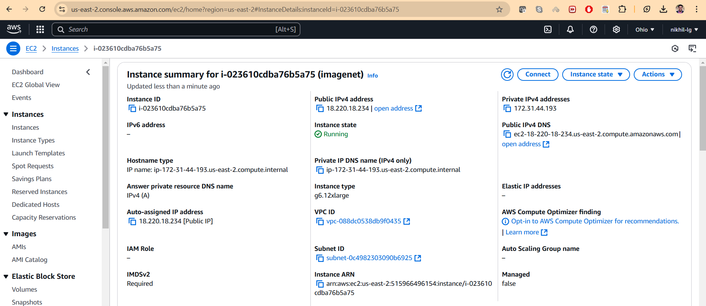

## ImageNet ResNet50 Classifier on AWS 🖼️🤖

This project implements a ResNet-50 model trained from scratch on the ImageNet dataset, leveraging two distinct workflows:

- *Local Training*: Utilizing a multi-GPU setup for efficient training on a local server.

- *AWS-Based Training*: Establishing a complete end-to-end pipeline on AWS, from dataset collection to model training.

The trained model is deployed as an interactive web application on Hugging Face Spaces 🌐, enabling users to perform real-time image classification with top-5 predictions and confidence scores.

## Project Structure 🗂️

```bash
project_root/
├── src/
│ └── train_resnet50_local.py      # Main file for local training
│ └── train_resnet50_aws.py     # Main file for AWS training
│ └── organize_val_data_imagenet.py      # Validation data reformatting
│ └── upload_imagenet_data_s3.py     # Uploader for AWS S3
│ ├── app.py    # Inference script
│ └── imagenet_classes.json  
├── images/
│ └── img1.PNG
├── requirements.txt # Project dependencies
└── README.md        # Project documentation
```


## Setup ⚙️

1. Clone the repository:
```bash
git clone https://github.com/yourusername/imagenet-classifier.git
cd imagenet-classifier
```

2. Install dependencies:
```bash
pip install -r requirements.txt
```

### AWS Workflow Overview 🚀

1. **Dataset Preparation** 📂  
   - Created an empty bucket in **Amazon S3** for storage.  
   - Executed a script to upload the dataset to the S3 bucket for easy access across instances. ⬆️

2. **Instance Setup and Configuration** 💻  
   - Launched a **g6.12xlarge instance** with 4 GPUs for efficient training. 🖥️⚡  
   - Implemented mechanisms to periodically upload the log file 📝 and model checkpoints 🗂️ to S3, enabling seamless resumption of training in case of spot instance interruptions. 🔄

3. **Training** 🎓  
   - Trained the model for **150 epochs**, leveraging multi-GPU capabilities. 🚀  
   - Added a condition to stop training early if the model achieved **70% test accuracy**, ensuring efficient use of resources. ✅

### 🖼️ AWS Steps with Screenshots

<details>
  <summary>📂 Step 1: Dataset Upload</summary>

  - **Uploaded Dataset to S3:**  
    

</details>

<details>
  <summary>💻 Step 2: Instance Setup and Configuration</summary>

  - **Launched g6.12xlarge Instance:**  
    

</details>

<details>
  <summary>🎓 Step 3: Training</summary>

  - **Training in Progress:**  
    
    
  - **GPU Utilization:**  
    

  - **Configured Logging and Checkpoint Saving to S3:**  
    

  - **Logs in S3:**  
    

  - **Checkpoints in S3:**  
    
</details>

  
## Dataset Preparation 📊

1. Download ImageNet dataset from Kaggle using kaggle API

```bash
kaggle competitions download -c imagenet-object-localization-challenge
```

2. Extract the images
```bash
unzip imagenet-object-localization-challenge.zip
```

3. Organize validation data:

```bash
python organize_val_data_imagenet.py -d ILSVRC/Data/CLS-LOC/val -l LOC_val_solution.csv
```

4. Final dataset structure:

```bash
ILSVRC/
├── train/
│ ├── n01440764/
│ ├── n01443537/
│ └── ...
└── val/
├── n01440764/
├── n01443537/
└── ...
```

5. Upload dataset to S3 (for AWS Approach)

To efficiently train the model on AWS, I will utilize spot instances for cost-effectiveness. Since spot instances can be terminated at any time, the dataset will be uploaded to Amazon S3. By storing the data in S3, it becomes accessible across instances, ensuring seamless training continuity regardless of instance availability.
```bash
aws configure
Enter Access key, Secret access key & Region
python upload_imagenet_data_s3.py
```

## Model Architecture 🏗️

ResNet50 architecture:
- 5 stages of residual blocks 🔲
- Bottleneck blocks with expansion factor 4 🏗️
- ~25.6M parameters 🔢
- Input size: 224x224x3 📐
- Output: 1000 classes (ImageNet) 🏆


## Training 🚀

1. Configure parameters in Config class in train_resnet50_local.py or train_resnet50_aws.py

2. Single GPU training 💻:

```bash
python train_resnet50_local.py
(or)
python train_resnet50_aws.py
```

3. Multi-GPU training (local/AWS) 🖥️🖥️🖥️🖥️:

```bash
CUDA_VISIBLE_DEVICES=0,1,2,3 torchrun --nproc_per_node=4 train_resnet50_local.py
(or)
CUDA_VISIBLE_DEVICES=0,1,2,3 torchrun --nproc_per_node=4 train_resnet50_aws.py
```

#### Training features:
- Mixed precision training ⚡
- Gradient accumulation 📈
- Learning rate warmup 🔥
- Cosine annealing 🌗
- Distributed training support 🌐
- TensorBoard logging 📊
- Checkpoint saving 💾

### 📜 Training Logs

<details>
  <summary>Local Training Logs</summary>
  
  ```bash
2024-12-27 01:01:25,524 - INFO - Starting training on laojia
2024-12-27 01:01:25,524 - INFO - Available GPUs: 4
2024-12-27 01:01:25,524 - INFO - Training started at: 2024-12-27 01:01:25.255041
2024-12-27 01:01:29,126 - INFO - Dataset Statistics:
2024-12-27 01:01:29,126 - INFO - Training samples: 1281167
2024-12-27 01:01:29,126 - INFO - Validation samples: 50000
2024-12-27 01:01:29,126 - INFO - Number of classes: 1000
2024-12-27 01:01:29,126 - INFO - Batch size: 512
2024-12-27 01:01:29,126 - INFO - Training batches per epoch: 626
2024-12-27 01:01:29,126 - INFO - Validation batches per epoch: 25
2024-12-27 01:01:29,126 - INFO - Starting epoch 0
2024-12-27 01:08:05,435 - INFO - Epoch 0 completed in 0:06:36.308191, Training Loss: 7.1116, Training Accuracy: 0.10%
2024-12-27 01:08:20,009 - INFO - Validation metrics - Top1 Acc: 0.10%, Top5 Acc: 0.51%, Val Loss: 7.0389
2024-12-27 01:08:20,009 - INFO - Total training time so far: 0:06:36.308191
2024-12-27 01:08:20,230 - INFO - Starting epoch 1
2024-12-27 01:14:34,410 - INFO - Epoch 1 completed in 0:06:14.179121, Training Loss: 6.8304, Training Accuracy: 0.34%
2024-12-27 01:14:47,443 - INFO - Validation metrics - Top1 Acc: 1.14%, Top5 Acc: 3.98%, Val Loss: 6.5877
2024-12-27 01:14:47,443 - INFO - Total training time so far: 0:12:50.487312
2024-12-27 01:14:48,113 - INFO - Starting epoch 2
2024-12-27 01:21:00,781 - INFO - Epoch 2 completed in 0:06:12.666870, Training Loss: 6.2409, Training Accuracy: 2.59%
2024-12-27 01:21:14,148 - INFO - Validation metrics - Top1 Acc: 6.07%, Top5 Acc: 17.09%, Val Loss: 5.7205
2024-12-27 01:21:14,149 - INFO - Total training time so far: 0:19:03.154182
2024-12-27 01:21:14,718 - INFO - Starting epoch 3
2024-12-27 01:27:26,587 - INFO - Epoch 3 completed in 0:06:11.867945, Training Loss: 5.6797, Training Accuracy: 6.77%
2024-12-27 01:27:41,007 - INFO - Validation metrics - Top1 Acc: 10.78%, Top5 Acc: 25.37%, Val Loss: 5.3062
2024-12-27 01:27:41,008 - INFO - Total training time so far: 0:25:15.022127
2024-12-27 01:27:41,639 - INFO - Starting epoch 4
2024-12-27 01:33:53,041 - INFO - Epoch 4 completed in 0:06:11.400760, Training Loss: 5.2345, Training Accuracy: 11.83%
2024-12-27 01:34:07,819 - INFO - Validation metrics - Top1 Acc: 17.43%, Top5 Acc: 38.13%, Val Loss: 4.7579
2024-12-27 01:34:07,820 - INFO - Total training time so far: 0:31:26.422887
2024-12-27 01:34:08,540 - INFO - Starting epoch 5
2024-12-27 01:40:21,819 - INFO - Epoch 5 completed in 0:06:13.277943, Training Loss: 4.8329, Training Accuracy: 17.38%
2024-12-27 01:40:36,394 - INFO - Validation metrics - Top1 Acc: 20.22%, Top5 Acc: 41.78%, Val Loss: 4.6447
2024-12-27 01:40:36,394 - INFO - Total training time so far: 0:37:39.700830
2024-12-27 01:40:36,968 - INFO - Starting epoch 6
2024-12-27 01:46:49,348 - INFO - Epoch 6 completed in 0:06:12.379204, Training Loss: 4.4693, Training Accuracy: 23.03%
2024-12-27 01:47:05,570 - INFO - Validation metrics - Top1 Acc: 28.18%, Top5 Acc: 53.18%, Val Loss: 4.0793
2024-12-27 01:47:05,570 - INFO - Total training time so far: 0:43:52.080034
2024-12-27 01:47:06,253 - INFO - Starting epoch 7
2024-12-27 01:53:17,701 - INFO - Epoch 7 completed in 0:06:11.447183, Training Loss: 4.1942, Training Accuracy: 27.74%
2024-12-27 01:53:29,753 - INFO - Validation metrics - Top1 Acc: 30.81%, Top5 Acc: 55.98%, Val Loss: 3.9830
2024-12-27 01:53:29,753 - INFO - Total training time so far: 0:50:03.527217
2024-12-27 01:53:30,387 - INFO - Starting epoch 8
2024-12-27 01:59:43,751 - INFO - Epoch 8 completed in 0:06:13.363023, Training Loss: 3.9910, Training Accuracy: 31.43%
2024-12-27 01:59:57,209 - INFO - Validation metrics - Top1 Acc: 36.39%, Top5 Acc: 62.66%, Val Loss: 3.6922
2024-12-27 01:59:57,210 - INFO - Total training time so far: 0:56:16.890240
2024-12-27 01:59:57,952 - INFO - Starting epoch 9
2024-12-27 02:06:09,828 - INFO - Epoch 9 completed in 0:06:11.875641, Training Loss: 3.8342, Training Accuracy: 34.40%
2024-12-27 02:06:23,191 - INFO - Validation metrics - Top1 Acc: 40.62%, Top5 Acc: 66.21%, Val Loss: 3.4533
2024-12-27 02:06:23,191 - INFO - Total training time so far: 1:02:28.765881
2024-12-27 02:06:23,918 - INFO - Starting epoch 10
2024-12-27 02:12:35,312 - INFO - Epoch 10 completed in 0:06:11.393481, Training Loss: 3.7012, Training Accuracy: 37.14%
2024-12-27 02:12:48,704 - INFO - Validation metrics - Top1 Acc: 40.55%, Top5 Acc: 66.87%, Val Loss: 3.4455
2024-12-27 02:12:48,704 - INFO - Total training time so far: 1:08:40.159362
2024-12-27 02:12:49,370 - INFO - Starting epoch 11
2024-12-27 02:19:01,113 - INFO - Epoch 11 completed in 0:06:11.741962, Training Loss: 3.5853, Training Accuracy: 39.27%
2024-12-27 02:19:13,942 - INFO - Validation metrics - Top1 Acc: 42.12%, Top5 Acc: 68.15%, Val Loss: 3.3807
2024-12-27 02:19:13,942 - INFO - Total training time so far: 1:14:51.901324
2024-12-27 02:19:14,532 - INFO - Starting epoch 12
2024-12-27 02:25:25,380 - INFO - Epoch 12 completed in 0:06:10.846853, Training Loss: 3.5081, Training Accuracy: 40.82%
2024-12-27 02:25:38,696 - INFO - Validation metrics - Top1 Acc: 44.64%, Top5 Acc: 70.19%, Val Loss: 3.2737
2024-12-27 02:25:38,696 - INFO - Total training time so far: 1:21:02.748177
2024-12-27 02:25:39,335 - INFO - Starting epoch 13
2024-12-27 02:31:52,921 - INFO - Epoch 13 completed in 0:06:13.585772, Training Loss: 3.4221, Training Accuracy: 42.73%
2024-12-27 02:32:05,717 - INFO - Validation metrics - Top1 Acc: 46.45%, Top5 Acc: 71.35%, Val Loss: 3.2081
2024-12-27 02:32:05,717 - INFO - Total training time so far: 1:27:16.333949
2024-12-27 02:32:06,317 - INFO - Starting epoch 14
2024-12-27 02:38:20,186 - INFO - Epoch 14 completed in 0:06:13.868442, Training Loss: 3.3564, Training Accuracy: 44.05%
2024-12-27 02:38:34,188 - INFO - Validation metrics - Top1 Acc: 48.26%, Top5 Acc: 74.03%, Val Loss: 3.1010
2024-12-27 02:38:34,189 - INFO - Total training time so far: 1:33:30.202391
2024-12-27 02:38:34,819 - INFO - Starting epoch 15
2024-12-27 02:44:48,114 - INFO - Epoch 15 completed in 0:06:13.294378, Training Loss: 3.3029, Training Accuracy: 45.12%
2024-12-27 02:45:04,199 - INFO - Validation metrics - Top1 Acc: 52.17%, Top5 Acc: 76.52%, Val Loss: 2.9472
2024-12-27 02:45:04,199 - INFO - Total training time so far: 1:39:43.496769
2024-12-27 02:45:04,793 - INFO - Starting epoch 16
2024-12-27 02:51:19,183 - INFO - Epoch 16 completed in 0:06:14.389536, Training Loss: 3.2535, Training Accuracy: 46.15%
2024-12-27 02:51:32,861 - INFO - Validation metrics - Top1 Acc: 51.95%, Top5 Acc: 77.21%, Val Loss: 2.9358
2024-12-27 02:51:32,861 - INFO - Total training time so far: 1:45:57.886305
2024-12-27 02:51:33,540 - INFO - Starting epoch 17
2024-12-27 02:57:45,222 - INFO - Epoch 17 completed in 0:06:11.680759, Training Loss: 3.2034, Training Accuracy: 47.16%
2024-12-27 02:57:59,077 - INFO - Validation metrics - Top1 Acc: 50.75%, Top5 Acc: 75.63%, Val Loss: 2.9985
2024-12-27 02:57:59,078 - INFO - Total training time so far: 1:52:09.567064
2024-12-27 02:57:59,723 - INFO - Starting epoch 18
2024-12-27 03:04:11,490 - INFO - Epoch 18 completed in 0:06:11.759077, Training Loss: 3.1596, Training Accuracy: 48.13%
2024-12-27 03:04:24,321 - INFO - Validation metrics - Top1 Acc: 51.11%, Top5 Acc: 75.60%, Val Loss: 2.9867
2024-12-27 03:04:24,321 - INFO - Total training time so far: 1:58:21.326141
2024-12-27 03:04:24,994 - INFO - Starting epoch 19
2024-12-27 03:10:37,262 - INFO - Epoch 19 completed in 0:06:12.267412, Training Loss: 3.1234, Training Accuracy: 48.96%
2024-12-27 03:10:50,403 - INFO - Validation metrics - Top1 Acc: 53.45%, Top5 Acc: 78.22%, Val Loss: 2.8714
2024-12-27 03:10:50,404 - INFO - Total training time so far: 2:04:33.593553
2024-12-27 03:10:51,096 - INFO - Starting epoch 20
2024-12-27 03:17:03,118 - INFO - Epoch 20 completed in 0:06:12.021373, Training Loss: 3.0924, Training Accuracy: 49.62%
2024-12-27 03:17:17,208 - INFO - Validation metrics - Top1 Acc: 54.99%, Top5 Acc: 79.26%, Val Loss: 2.8065
2024-12-27 03:17:17,208 - INFO - Total training time so far: 2:10:45.614926
2024-12-27 03:17:17,803 - INFO - Starting epoch 21
2024-12-27 03:23:30,430 - INFO - Epoch 21 completed in 0:06:12.626178, Training Loss: 3.0614, Training Accuracy: 50.15%
2024-12-27 03:23:42,287 - INFO - Validation metrics - Top1 Acc: 54.78%, Top5 Acc: 79.21%, Val Loss: 2.8167
2024-12-27 03:23:42,287 - INFO - Total training time so far: 2:16:58.241104
2024-12-27 03:23:43,164 - INFO - Starting epoch 22
2024-12-27 03:29:58,465 - INFO - Epoch 22 completed in 0:06:15.301115, Training Loss: 3.0319, Training Accuracy: 50.82%
2024-12-27 03:30:12,291 - INFO - Validation metrics - Top1 Acc: 55.41%, Top5 Acc: 79.26%, Val Loss: 2.7932
2024-12-27 03:30:12,291 - INFO - Total training time so far: 2:23:13.542219
2024-12-27 03:30:12,908 - INFO - Starting epoch 23
2024-12-27 03:36:27,594 - INFO - Epoch 23 completed in 0:06:14.685474, Training Loss: 3.0127, Training Accuracy: 51.26%
2024-12-27 03:36:41,582 - INFO - Validation metrics - Top1 Acc: 55.41%, Top5 Acc: 79.38%, Val Loss: 2.7875
2024-12-27 03:36:41,583 - INFO - Total training time so far: 2:29:28.227693
2024-12-27 03:36:42,236 - INFO - Starting epoch 24
2024-12-27 03:42:55,531 - INFO - Epoch 24 completed in 0:06:13.293783, Training Loss: 2.9847, Training Accuracy: 51.93%
2024-12-27 03:43:10,040 - INFO - Validation metrics - Top1 Acc: 55.65%, Top5 Acc: 79.74%, Val Loss: 2.7661
2024-12-27 03:43:10,041 - INFO - Total training time so far: 2:35:41.521476
2024-12-27 03:43:10,739 - INFO - Starting epoch 25
2024-12-27 03:49:24,044 - INFO - Epoch 25 completed in 0:06:13.305221, Training Loss: 2.9672, Training Accuracy: 52.23%
2024-12-27 03:49:38,037 - INFO - Validation metrics - Top1 Acc: 57.17%, Top5 Acc: 80.80%, Val Loss: 2.7086
2024-12-27 03:49:38,038 - INFO - Total training time so far: 2:41:54.826697
2024-12-27 03:49:38,671 - INFO - Starting epoch 26
2024-12-27 03:55:51,819 - INFO - Epoch 26 completed in 0:06:13.146599, Training Loss: 2.9475, Training Accuracy: 52.72%
2024-12-27 03:56:06,838 - INFO - Validation metrics - Top1 Acc: 58.35%, Top5 Acc: 81.86%, Val Loss: 2.6533
2024-12-27 03:56:06,839 - INFO - Total training time so far: 2:48:07.973296
2024-12-27 03:56:07,480 - INFO - Starting epoch 27
2024-12-27 04:02:20,948 - INFO - Epoch 27 completed in 0:06:13.466527, Training Loss: 2.9277, Training Accuracy: 53.03%
2024-12-27 04:02:34,612 - INFO - Validation metrics - Top1 Acc: 56.23%, Top5 Acc: 79.63%, Val Loss: 2.7621
2024-12-27 04:02:34,613 - INFO - Total training time so far: 2:54:21.439823
2024-12-27 04:02:35,165 - INFO - Starting epoch 28
2024-12-27 04:08:48,704 - INFO - Epoch 28 completed in 0:06:13.537776, Training Loss: 2.9056, Training Accuracy: 53.56%
2024-12-27 04:09:02,215 - INFO - Validation metrics - Top1 Acc: 59.21%, Top5 Acc: 82.22%, Val Loss: 2.6215
2024-12-27 04:09:02,215 - INFO - Total training time so far: 3:00:34.977599
2024-12-27 04:09:02,936 - INFO - Starting epoch 29
2024-12-27 04:15:17,968 - INFO - Epoch 29 completed in 0:06:15.031875, Training Loss: 2.8956, Training Accuracy: 53.85%
2024-12-27 04:15:32,334 - INFO - Validation metrics - Top1 Acc: 59.80%, Top5 Acc: 82.90%, Val Loss: 2.5879
2024-12-27 04:15:32,334 - INFO - Total training time so far: 3:06:50.009474
2024-12-27 04:15:32,895 - INFO - Starting epoch 30
2024-12-27 04:21:47,389 - INFO - Epoch 30 completed in 0:06:14.492525, Training Loss: 2.8791, Training Accuracy: 54.18%
2024-12-27 04:22:02,247 - INFO - Validation metrics - Top1 Acc: 57.90%, Top5 Acc: 81.46%, Val Loss: 2.6684
2024-12-27 04:22:02,247 - INFO - Total training time so far: 3:13:04.501999
2024-12-27 04:22:02,900 - INFO - Starting epoch 31
2024-12-27 04:28:15,365 - INFO - Epoch 31 completed in 0:06:12.464431, Training Loss: 2.8667, Training Accuracy: 54.48%
2024-12-27 04:28:28,974 - INFO - Validation metrics - Top1 Acc: 57.60%, Top5 Acc: 81.17%, Val Loss: 2.6759
2024-12-27 04:28:28,975 - INFO - Total training time so far: 3:19:16.966430
2024-12-27 04:28:29,541 - INFO - Starting epoch 32
2024-12-27 04:34:43,927 - INFO - Epoch 32 completed in 0:06:14.385287, Training Loss: 2.8465, Training Accuracy: 54.83%
2024-12-27 04:34:57,994 - INFO - Validation metrics - Top1 Acc: 59.08%, Top5 Acc: 82.52%, Val Loss: 2.6068
2024-12-27 04:34:57,994 - INFO - Total training time so far: 3:25:31.351717
2024-12-27 04:34:58,560 - INFO - Starting epoch 33
2024-12-27 04:41:12,422 - INFO - Epoch 33 completed in 0:06:13.861663, Training Loss: 2.8332, Training Accuracy: 55.16%
2024-12-27 04:41:26,941 - INFO - Validation metrics - Top1 Acc: 60.30%, Top5 Acc: 83.48%, Val Loss: 2.5462
2024-12-27 04:41:26,941 - INFO - Total training time so far: 3:31:45.213380
2024-12-27 04:41:27,505 - INFO - Starting epoch 34
2024-12-27 04:47:40,219 - INFO - Epoch 34 completed in 0:06:12.713988, Training Loss: 2.8160, Training Accuracy: 55.57%
2024-12-27 04:47:54,433 - INFO - Validation metrics - Top1 Acc: 61.83%, Top5 Acc: 84.60%, Val Loss: 2.5003
2024-12-27 04:47:54,433 - INFO - Total training time so far: 3:37:57.927368
2024-12-27 04:47:55,034 - INFO - Starting epoch 35
2024-12-27 04:54:09,809 - INFO - Epoch 35 completed in 0:06:14.775174, Training Loss: 2.8115, Training Accuracy: 55.63%
2024-12-27 04:54:24,739 - INFO - Validation metrics - Top1 Acc: 59.21%, Top5 Acc: 82.33%, Val Loss: 2.6076
2024-12-27 04:54:24,740 - INFO - Total training time so far: 3:44:12.702542
2024-12-27 04:54:25,334 - INFO - Starting epoch 36
2024-12-27 05:00:37,621 - INFO - Epoch 36 completed in 0:06:12.286695, Training Loss: 2.8002, Training Accuracy: 55.97%
2024-12-27 05:00:51,056 - INFO - Validation metrics - Top1 Acc: 60.08%, Top5 Acc: 83.47%, Val Loss: 2.5507
2024-12-27 05:00:51,057 - INFO - Total training time so far: 3:50:24.989237
2024-12-27 05:00:51,648 - INFO - Starting epoch 37
2024-12-27 05:07:05,510 - INFO - Epoch 37 completed in 0:06:13.861949, Training Loss: 2.7887, Training Accuracy: 56.12%
2024-12-27 05:07:19,307 - INFO - Validation metrics - Top1 Acc: 61.51%, Top5 Acc: 84.17%, Val Loss: 2.5015
2024-12-27 05:07:19,307 - INFO - Total training time so far: 3:56:38.851186
2024-12-27 05:07:20,059 - INFO - Starting epoch 38
2024-12-27 05:13:32,693 - INFO - Epoch 38 completed in 0:06:12.633436, Training Loss: 2.7730, Training Accuracy: 56.47%
2024-12-27 05:13:46,468 - INFO - Validation metrics - Top1 Acc: 61.20%, Top5 Acc: 83.58%, Val Loss: 2.5275
2024-12-27 05:13:46,470 - INFO - Total training time so far: 4:02:51.484622
2024-12-27 05:13:47,066 - INFO - Starting epoch 39
2024-12-27 05:19:59,428 - INFO - Epoch 39 completed in 0:06:12.360756, Training Loss: 2.7682, Training Accuracy: 56.47%
2024-12-27 05:20:14,489 - INFO - Validation metrics - Top1 Acc: 60.27%, Top5 Acc: 83.21%, Val Loss: 2.5571
2024-12-27 05:20:14,489 - INFO - Total training time so far: 4:09:03.845378
2024-12-27 05:20:15,082 - INFO - Starting epoch 40
2024-12-27 05:26:28,186 - INFO - Epoch 40 completed in 0:06:13.102673, Training Loss: 2.7547, Training Accuracy: 56.89%
2024-12-27 05:26:42,218 - INFO - Validation metrics - Top1 Acc: 59.58%, Top5 Acc: 82.64%, Val Loss: 2.5764
2024-12-27 05:26:42,218 - INFO - Total training time so far: 4:15:16.948051
2024-12-27 05:26:42,757 - INFO - Starting epoch 41
2024-12-27 05:32:54,736 - INFO - Epoch 41 completed in 0:06:11.977886, Training Loss: 2.7483, Training Accuracy: 56.97%
2024-12-27 05:33:08,691 - INFO - Validation metrics - Top1 Acc: 60.57%, Top5 Acc: 83.78%, Val Loss: 2.5236
2024-12-27 05:33:08,691 - INFO - Total training time so far: 4:21:28.925937
2024-12-27 05:33:09,364 - INFO - Starting epoch 42
2024-12-27 05:39:20,913 - INFO - Epoch 42 completed in 0:06:11.548278, Training Loss: 2.7321, Training Accuracy: 57.24%
2024-12-27 05:39:37,365 - INFO - Validation metrics - Top1 Acc: 61.82%, Top5 Acc: 83.71%, Val Loss: 2.4968
2024-12-27 05:39:37,365 - INFO - Total training time so far: 4:27:40.474215
2024-12-27 05:39:37,929 - INFO - Starting epoch 43
2024-12-27 05:45:48,364 - INFO - Epoch 43 completed in 0:06:10.434363, Training Loss: 2.7290, Training Accuracy: 57.42%
2024-12-27 05:46:02,043 - INFO - Validation metrics - Top1 Acc: 62.66%, Top5 Acc: 85.08%, Val Loss: 2.4468
2024-12-27 05:46:02,043 - INFO - Total training time so far: 4:33:50.908578
2024-12-27 05:46:02,675 - INFO - Starting epoch 44
2024-12-27 05:52:15,347 - INFO - Epoch 44 completed in 0:06:12.671020, Training Loss: 2.7189, Training Accuracy: 57.65%
2024-12-27 05:52:28,762 - INFO - Validation metrics - Top1 Acc: 59.93%, Top5 Acc: 82.90%, Val Loss: 2.5696
2024-12-27 05:52:28,763 - INFO - Total training time so far: 4:40:03.579598
2024-12-27 05:52:29,409 - INFO - Starting epoch 45
2024-12-27 05:58:42,427 - INFO - Epoch 45 completed in 0:06:13.017378, Training Loss: 2.7090, Training Accuracy: 57.80%
2024-12-27 05:58:55,101 - INFO - Validation metrics - Top1 Acc: 62.72%, Top5 Acc: 84.92%, Val Loss: 2.4373
2024-12-27 05:58:55,101 - INFO - Total training time so far: 4:46:16.596976
2024-12-27 05:58:55,713 - INFO - Starting epoch 46
2024-12-27 06:05:07,549 - INFO - Epoch 46 completed in 0:06:11.835564, Training Loss: 2.7019, Training Accuracy: 57.95%
2024-12-27 06:05:21,464 - INFO - Validation metrics - Top1 Acc: 61.83%, Top5 Acc: 84.29%, Val Loss: 2.4856
2024-12-27 06:05:21,464 - INFO - Total training time so far: 4:52:28.432540
2024-12-27 06:05:22,143 - INFO - Starting epoch 47
2024-12-27 06:11:35,841 - INFO - Epoch 47 completed in 0:06:13.697387, Training Loss: 2.6919, Training Accuracy: 58.27%
2024-12-27 06:11:49,195 - INFO - Validation metrics - Top1 Acc: 61.83%, Top5 Acc: 84.91%, Val Loss: 2.4684
2024-12-27 06:11:49,196 - INFO - Total training time so far: 4:58:42.129927
2024-12-27 06:11:49,939 - INFO - Starting epoch 48
2024-12-27 06:18:02,327 - INFO - Epoch 48 completed in 0:06:12.387098, Training Loss: 2.6828, Training Accuracy: 58.35%
2024-12-27 06:18:15,559 - INFO - Validation metrics - Top1 Acc: 62.36%, Top5 Acc: 84.46%, Val Loss: 2.4719
2024-12-27 06:18:15,559 - INFO - Total training time so far: 5:04:54.517025
2024-12-27 06:18:16,139 - INFO - Starting epoch 49
2024-12-27 06:24:29,517 - INFO - Epoch 49 completed in 0:06:13.376720, Training Loss: 2.6702, Training Accuracy: 58.74%
2024-12-27 06:24:44,406 - INFO - Validation metrics - Top1 Acc: 63.02%, Top5 Acc: 85.40%, Val Loss: 2.4421
2024-12-27 06:24:44,406 - INFO - Total training time so far: 5:11:07.893745
2024-12-27 06:24:45,009 - INFO - Starting epoch 50
2024-12-27 06:30:58,290 - INFO - Epoch 50 completed in 0:06:13.278793, Training Loss: 2.6656, Training Accuracy: 58.81%
2024-12-27 06:31:11,920 - INFO - Validation metrics - Top1 Acc: 64.34%, Top5 Acc: 86.59%, Val Loss: 2.3691
2024-12-27 06:31:11,920 - INFO - Total training time so far: 5:17:21.172538
2024-12-27 06:31:12,588 - INFO - Starting epoch 51
2024-12-27 06:37:27,197 - INFO - Epoch 51 completed in 0:06:14.608627, Training Loss: 2.6582, Training Accuracy: 58.97%
2024-12-27 06:37:39,503 - INFO - Validation metrics - Top1 Acc: 63.19%, Top5 Acc: 85.13%, Val Loss: 2.4305
2024-12-27 06:37:39,504 - INFO - Total training time so far: 5:23:35.781165
2024-12-27 06:37:40,108 - INFO - Starting epoch 52
2024-12-27 06:43:53,001 - INFO - Epoch 52 completed in 0:06:12.891163, Training Loss: 2.6481, Training Accuracy: 59.21%
2024-12-27 06:44:05,278 - INFO - Validation metrics - Top1 Acc: 63.85%, Top5 Acc: 85.42%, Val Loss: 2.4196
2024-12-27 06:44:05,279 - INFO - Total training time so far: 5:29:48.672328
2024-12-27 06:44:06,013 - INFO - Starting epoch 53
2024-12-27 06:50:19,315 - INFO - Epoch 53 completed in 0:06:13.301412, Training Loss: 2.6447, Training Accuracy: 59.29%
2024-12-27 06:50:32,484 - INFO - Validation metrics - Top1 Acc: 63.42%, Top5 Acc: 85.58%, Val Loss: 2.4104
2024-12-27 06:50:32,491 - INFO - Total training time so far: 5:36:01.973740
2024-12-27 06:50:33,291 - INFO - Starting epoch 54
2024-12-27 06:56:45,148 - INFO - Epoch 54 completed in 0:06:11.856421, Training Loss: 2.6362, Training Accuracy: 59.45%
2024-12-27 06:56:59,848 - INFO - Validation metrics - Top1 Acc: 63.93%, Top5 Acc: 86.13%, Val Loss: 2.3745
2024-12-27 06:56:59,849 - INFO - Total training time so far: 5:42:13.830161
2024-12-27 06:57:00,491 - INFO - Starting epoch 55
2024-12-27 07:03:14,412 - INFO - Epoch 55 completed in 0:06:13.920568, Training Loss: 2.6263, Training Accuracy: 59.71%
2024-12-27 07:03:27,332 - INFO - Validation metrics - Top1 Acc: 61.91%, Top5 Acc: 83.91%, Val Loss: 2.4787
2024-12-27 07:03:27,332 - INFO - Total training time so far: 5:48:27.750729
2024-12-27 07:03:27,951 - INFO - Starting epoch 56
2024-12-27 07:09:40,378 - INFO - Epoch 56 completed in 0:06:12.425981, Training Loss: 2.6164, Training Accuracy: 59.99%
2024-12-27 07:09:54,510 - INFO - Validation metrics - Top1 Acc: 64.66%, Top5 Acc: 86.85%, Val Loss: 2.3404
2024-12-27 07:09:54,511 - INFO - Total training time so far: 5:54:40.176710
2024-12-27 07:09:55,204 - INFO - Starting epoch 57
2024-12-27 07:16:08,536 - INFO - Epoch 57 completed in 0:06:13.330003, Training Loss: 2.6112, Training Accuracy: 60.08%
2024-12-27 07:16:21,278 - INFO - Validation metrics - Top1 Acc: 64.62%, Top5 Acc: 86.58%, Val Loss: 2.3534
2024-12-27 07:16:21,278 - INFO - Total training time so far: 6:00:53.506713
2024-12-27 07:16:21,968 - INFO - Starting epoch 58
2024-12-27 07:22:35,060 - INFO - Epoch 58 completed in 0:06:13.090961, Training Loss: 2.6025, Training Accuracy: 60.21%
2024-12-27 07:22:49,700 - INFO - Validation metrics - Top1 Acc: 63.77%, Top5 Acc: 86.90%, Val Loss: 2.3637
2024-12-27 07:22:49,700 - INFO - Total training time so far: 6:07:06.597674
2024-12-27 07:22:50,276 - INFO - Starting epoch 59
2024-12-27 07:29:04,283 - INFO - Epoch 59 completed in 0:06:14.006693, Training Loss: 2.5955, Training Accuracy: 60.30%
2024-12-27 07:29:17,368 - INFO - Validation metrics - Top1 Acc: 64.74%, Top5 Acc: 86.43%, Val Loss: 2.3404
2024-12-27 07:29:17,369 - INFO - Total training time so far: 6:13:20.604367
2024-12-27 07:29:18,019 - INFO - Starting epoch 60
2024-12-27 07:35:30,329 - INFO - Epoch 60 completed in 0:06:12.309048, Training Loss: 2.5887, Training Accuracy: 60.61%
2024-12-27 07:35:43,348 - INFO - Validation metrics - Top1 Acc: 64.38%, Top5 Acc: 86.42%, Val Loss: 2.3682
2024-12-27 07:35:43,349 - INFO - Total training time so far: 6:19:32.913415
2024-12-27 07:35:44,010 - INFO - Starting epoch 61
2024-12-27 07:41:56,141 - INFO - Epoch 61 completed in 0:06:12.130154, Training Loss: 2.5813, Training Accuracy: 60.72%
2024-12-27 07:42:09,789 - INFO - Validation metrics - Top1 Acc: 65.28%, Top5 Acc: 86.65%, Val Loss: 2.3466
2024-12-27 07:42:09,789 - INFO - Total training time so far: 6:25:45.043569
2024-12-27 07:42:10,433 - INFO - Starting epoch 62
2024-12-27 07:48:23,594 - INFO - Epoch 62 completed in 0:06:13.160430, Training Loss: 2.5744, Training Accuracy: 60.93%
2024-12-27 07:48:37,111 - INFO - Validation metrics - Top1 Acc: 65.48%, Top5 Acc: 86.85%, Val Loss: 2.3148
2024-12-27 07:48:37,111 - INFO - Total training time so far: 6:31:58.203999
2024-12-27 07:48:37,695 - INFO - Starting epoch 63
2024-12-27 07:54:51,566 - INFO - Epoch 63 completed in 0:06:13.869371, Training Loss: 2.5612, Training Accuracy: 61.18%
2024-12-27 07:55:04,782 - INFO - Validation metrics - Top1 Acc: 66.10%, Top5 Acc: 86.77%, Val Loss: 2.3061
2024-12-27 07:55:04,782 - INFO - Total training time so far: 6:38:12.073370
2024-12-27 07:55:05,355 - INFO - Starting epoch 64
2024-12-27 08:01:18,005 - INFO - Epoch 64 completed in 0:06:12.648801, Training Loss: 2.5610, Training Accuracy: 61.21%
2024-12-27 08:01:31,046 - INFO - Validation metrics - Top1 Acc: 65.06%, Top5 Acc: 86.35%, Val Loss: 2.3513
2024-12-27 08:01:31,047 - INFO - Total training time so far: 6:44:24.722171
2024-12-27 08:01:31,783 - INFO - Starting epoch 65
2024-12-27 08:07:45,499 - INFO - Epoch 65 completed in 0:06:13.715466, Training Loss: 2.5543, Training Accuracy: 61.29%
2024-12-27 08:07:59,759 - INFO - Validation metrics - Top1 Acc: 66.00%, Top5 Acc: 87.47%, Val Loss: 2.2973
2024-12-27 08:07:59,759 - INFO - Total training time so far: 6:50:38.437637
2024-12-27 08:08:00,376 - INFO - Starting epoch 66
2024-12-27 08:14:13,214 - INFO - Epoch 66 completed in 0:06:12.837116, Training Loss: 2.5449, Training Accuracy: 61.55%
2024-12-27 08:14:28,012 - INFO - Validation metrics - Top1 Acc: 66.82%, Top5 Acc: 88.03%, Val Loss: 2.2676
2024-12-27 08:14:28,012 - INFO - Total training time so far: 6:56:51.274753
2024-12-27 08:14:28,556 - INFO - Starting epoch 67
2024-12-27 08:20:40,120 - INFO - Epoch 67 completed in 0:06:11.563546, Training Loss: 2.5385, Training Accuracy: 61.66%
2024-12-27 08:20:53,125 - INFO - Validation metrics - Top1 Acc: 66.58%, Top5 Acc: 87.72%, Val Loss: 2.2744
2024-12-27 08:20:53,125 - INFO - Total training time so far: 7:03:02.838299
2024-12-27 08:20:53,795 - INFO - Starting epoch 68
2024-12-27 08:27:07,230 - INFO - Epoch 68 completed in 0:06:13.434442, Training Loss: 2.5288, Training Accuracy: 61.89%
2024-12-27 08:27:21,927 - INFO - Validation metrics - Top1 Acc: 67.22%, Top5 Acc: 88.02%, Val Loss: 2.2441
2024-12-27 08:27:21,927 - INFO - Total training time so far: 7:09:16.272741
2024-12-27 08:27:22,572 - INFO - Starting epoch 69
2024-12-27 08:33:35,032 - INFO - Epoch 69 completed in 0:06:12.459588, Training Loss: 2.5269, Training Accuracy: 61.98%
2024-12-27 08:33:48,126 - INFO - Validation metrics - Top1 Acc: 66.85%, Top5 Acc: 87.75%, Val Loss: 2.2528
2024-12-27 08:33:48,126 - INFO - Total training time so far: 7:15:28.732329
2024-12-27 08:33:48,717 - INFO - Starting epoch 70
2024-12-27 08:40:01,401 - INFO - Epoch 70 completed in 0:06:12.683233, Training Loss: 2.5151, Training Accuracy: 62.23%
2024-12-27 08:40:15,459 - INFO - Validation metrics - Top1 Acc: 67.66%, Top5 Acc: 88.35%, Val Loss: 2.2338
2024-12-27 08:40:15,460 - INFO - Total training time so far: 7:21:41.415562
2024-12-27 08:40:16,056 - INFO - Starting epoch 71
2024-12-27 08:46:28,272 - INFO - Epoch 71 completed in 0:06:12.215262, Training Loss: 2.5057, Training Accuracy: 62.50%
2024-12-27 08:46:44,790 - INFO - Validation metrics - Top1 Acc: 67.11%, Top5 Acc: 87.86%, Val Loss: 2.2531
2024-12-27 08:46:44,790 - INFO - Total training time so far: 7:27:53.630824
2024-12-27 08:46:45,495 - INFO - Starting epoch 72
2024-12-27 08:52:59,678 - INFO - Epoch 72 completed in 0:06:14.182380, Training Loss: 2.5077, Training Accuracy: 62.49%
2024-12-27 08:53:16,269 - INFO - Validation metrics - Top1 Acc: 67.46%, Top5 Acc: 88.26%, Val Loss: 2.2404
2024-12-27 08:53:16,270 - INFO - Total training time so far: 7:34:07.813204
2024-12-27 08:53:17,024 - INFO - Starting epoch 73
2024-12-27 08:59:31,282 - INFO - Epoch 73 completed in 0:06:14.256821, Training Loss: 2.4966, Training Accuracy: 62.76%
2024-12-27 08:59:43,833 - INFO - Validation metrics - Top1 Acc: 65.00%, Top5 Acc: 86.38%, Val Loss: 2.3377
2024-12-27 08:59:43,834 - INFO - Total training time so far: 7:40:22.070025
2024-12-27 08:59:44,408 - INFO - Starting epoch 74
2024-12-27 09:05:57,161 - INFO - Epoch 74 completed in 0:06:12.751034, Training Loss: 2.4909, Training Accuracy: 62.81%
2024-12-27 09:06:10,418 - INFO - Validation metrics - Top1 Acc: 67.69%, Top5 Acc: 88.57%, Val Loss: 2.2292
2024-12-27 09:06:10,419 - INFO - Total training time so far: 7:46:34.821059
2024-12-27 09:06:11,051 - INFO - Starting epoch 75
2024-12-27 09:12:25,856 - INFO - Epoch 75 completed in 0:06:14.803977, Training Loss: 2.4788, Training Accuracy: 63.06%
2024-12-27 09:12:39,998 - INFO - Validation metrics - Top1 Acc: 67.83%, Top5 Acc: 88.14%, Val Loss: 2.2326
2024-12-27 09:12:39,998 - INFO - Total training time so far: 7:52:49.625036
2024-12-27 09:12:40,580 - INFO - Starting epoch 76
2024-12-27 09:18:55,388 - INFO - Epoch 76 completed in 0:06:14.807592, Training Loss: 2.4739, Training Accuracy: 63.14%
2024-12-27 09:19:10,273 - INFO - Validation metrics - Top1 Acc: 68.98%, Top5 Acc: 89.27%, Val Loss: 2.1749
2024-12-27 09:19:10,274 - INFO - Total training time so far: 7:59:04.432628
2024-12-27 09:19:10,927 - INFO - Starting epoch 77
2024-12-27 09:25:25,215 - INFO - Epoch 77 completed in 0:06:14.287687, Training Loss: 2.4624, Training Accuracy: 63.48%
2024-12-27 09:25:38,505 - INFO - Validation metrics - Top1 Acc: 68.11%, Top5 Acc: 88.66%, Val Loss: 2.2086
2024-12-27 09:25:38,506 - INFO - Total training time so far: 8:05:18.720315
2024-12-27 09:25:39,219 - INFO - Starting epoch 78
2024-12-27 09:31:52,862 - INFO - Epoch 78 completed in 0:06:13.642026, Training Loss: 2.4642, Training Accuracy: 63.40%
2024-12-27 09:32:05,446 - INFO - Validation metrics - Top1 Acc: 67.86%, Top5 Acc: 88.18%, Val Loss: 2.2240
2024-12-27 09:32:05,446 - INFO - Total training time so far: 8:11:32.362341
2024-12-27 09:32:06,042 - INFO - Starting epoch 79
2024-12-27 09:38:17,491 - INFO - Epoch 79 completed in 0:06:11.448306, Training Loss: 2.4481, Training Accuracy: 63.94%
2024-12-27 09:38:34,409 - INFO - Validation metrics - Top1 Acc: 69.05%, Top5 Acc: 89.02%, Val Loss: 2.1862
2024-12-27 09:38:34,409 - INFO - Total training time so far: 8:17:43.810647
2024-12-27 09:38:35,003 - INFO - Starting epoch 80
2024-12-27 09:44:47,200 - INFO - Epoch 80 completed in 0:06:12.196452, Training Loss: 2.4380, Training Accuracy: 64.01%
2024-12-27 09:45:02,232 - INFO - Validation metrics - Top1 Acc: 68.54%, Top5 Acc: 88.93%, Val Loss: 2.1846
2024-12-27 09:45:02,232 - INFO - Total training time so far: 8:23:56.007099
2024-12-27 09:45:02,921 - INFO - Starting epoch 81
2024-12-27 09:51:16,568 - INFO - Epoch 81 completed in 0:06:13.645869, Training Loss: 2.4374, Training Accuracy: 64.18%
2024-12-27 09:51:29,261 - INFO - Validation metrics - Top1 Acc: 68.72%, Top5 Acc: 88.67%, Val Loss: 2.1931
2024-12-27 09:51:29,261 - INFO - Total training time so far: 8:30:09.652968
2024-12-27 09:51:29,868 - INFO - Starting epoch 82
2024-12-27 09:57:44,289 - INFO - Epoch 82 completed in 0:06:14.420917, Training Loss: 2.4306, Training Accuracy: 64.21%
2024-12-27 09:57:58,612 - INFO - Validation metrics - Top1 Acc: 68.44%, Top5 Acc: 88.53%, Val Loss: 2.1972
2024-12-27 09:57:58,612 - INFO - Total training time so far: 8:36:24.073885
2024-12-27 09:57:59,196 - INFO - Starting epoch 83
2024-12-27 10:04:12,085 - INFO - Epoch 83 completed in 0:06:12.888367, Training Loss: 2.4248, Training Accuracy: 64.44%
2024-12-27 10:04:25,221 - INFO - Validation metrics - Top1 Acc: 69.06%, Top5 Acc: 88.58%, Val Loss: 2.1868
2024-12-27 10:04:25,221 - INFO - Total training time so far: 8:42:36.962252
2024-12-27 10:04:25,875 - INFO - Starting epoch 84
2024-12-27 10:10:39,295 - INFO - Epoch 84 completed in 0:06:13.417526, Training Loss: 2.4129, Training Accuracy: 64.70%
2024-12-27 10:10:51,985 - INFO - Validation metrics - Top1 Acc: 69.59%, Top5 Acc: 89.38%, Val Loss: 2.1495
2024-12-27 10:10:51,985 - INFO - Total training time so far: 8:48:50.379778
2024-12-27 10:10:52,593 - INFO - Starting epoch 85
2024-12-27 10:17:07,075 - INFO - Epoch 85 completed in 0:06:14.481218, Training Loss: 2.4089, Training Accuracy: 64.75%
2024-12-27 10:17:21,489 - INFO - Validation metrics - Top1 Acc: 68.86%, Top5 Acc: 89.02%, Val Loss: 2.1744
2024-12-27 10:17:21,490 - INFO - Total training time so far: 8:55:04.860996
2024-12-27 10:17:22,091 - INFO - Starting epoch 86
2024-12-27 10:23:34,477 - INFO - Epoch 86 completed in 0:06:12.385020, Training Loss: 2.4022, Training Accuracy: 64.94%
2024-12-27 10:23:50,946 - INFO - Validation metrics - Top1 Acc: 68.90%, Top5 Acc: 89.14%, Val Loss: 2.1766
2024-12-27 10:23:50,947 - INFO - Total training time so far: 9:01:17.246016
2024-12-27 10:23:51,527 - INFO - Starting epoch 87
2024-12-27 10:30:02,973 - INFO - Epoch 87 completed in 0:06:11.443642, Training Loss: 2.3884, Training Accuracy: 65.26%
2024-12-27 10:30:16,910 - INFO - Validation metrics - Top1 Acc: 69.98%, Top5 Acc: 89.88%, Val Loss: 2.1348
2024-12-27 10:30:16,911 - INFO - Total training time so far: 9:07:28.689658
2024-12-27 10:30:17,485 - INFO - Starting epoch 88
2024-12-27 10:36:29,402 - INFO - Epoch 88 completed in 0:06:11.915138, Training Loss: 2.3807, Training Accuracy: 65.41%
2024-12-27 10:36:42,081 - INFO - Validation metrics - Top1 Acc: 69.54%, Top5 Acc: 89.46%, Val Loss: 2.1507
2024-12-27 10:36:42,081 - INFO - Total training time so far: 9:13:40.604796
2024-12-27 10:36:42,707 - INFO - Starting epoch 89
2024-12-27 10:42:54,069 - INFO - Epoch 89 completed in 0:06:11.361344, Training Loss: 2.3775, Training Accuracy: 65.58%
2024-12-27 10:43:06,732 - INFO - Validation metrics - Top1 Acc: 68.88%, Top5 Acc: 89.00%, Val Loss: 2.1825
2024-12-27 10:43:06,732 - INFO - Total training time so far: 9:19:51.966140
2024-12-27 10:43:07,353 - INFO - Starting epoch 90
2024-12-27 10:49:19,529 - INFO - Epoch 90 completed in 0:06:12.174456, Training Loss: 2.3700, Training Accuracy: 65.70%
2024-12-27 10:49:32,787 - INFO - Validation metrics - Top1 Acc: 69.03%, Top5 Acc: 89.54%, Val Loss: 2.1550
2024-12-27 10:49:32,787 - INFO - Total training time so far: 9:26:04.140596
2024-12-27 10:49:33,346 - INFO - Starting epoch 91
2024-12-27 10:55:46,476 - INFO - Epoch 91 completed in 0:06:13.129267, Training Loss: 2.3580, Training Accuracy: 66.05%
2024-12-27 10:56:01,478 - INFO - Validation metrics - Top1 Acc: 70.36%, Top5 Acc: 89.67%, Val Loss: 2.1149
2024-12-27 10:56:01,479 - INFO - Total training time so far: 9:32:17.269863
2024-12-27 10:56:02,078 - INFO - 
Target accuracy of 70% achieved! Current accuracy: 70.36%
2024-12-27 10:56:02,339 - INFO - Starting epoch 92
2024-12-27 11:02:22,257 - INFO - Epoch 92 completed in 0:06:19.917207, Training Loss: 2.3510, Training Accuracy: 66.19%
2024-12-27 11:02:39,262 - INFO - Validation metrics - Top1 Acc: 69.60%, Top5 Acc: 89.94%, Val Loss: 2.1302
2024-12-27 11:02:39,262 - INFO - Total training time so far: 9:38:37.187070
2024-12-27 11:02:39,877 - INFO - Starting epoch 93
2024-12-27 11:08:55,359 - INFO - Epoch 93 completed in 0:06:15.481929, Training Loss: 2.3464, Training Accuracy: 66.25%
2024-12-27 11:09:07,916 - INFO - Validation metrics - Top1 Acc: 70.58%, Top5 Acc: 89.84%, Val Loss: 2.1124
2024-12-27 11:09:07,916 - INFO - Total training time so far: 9:44:52.668999
2024-12-27 11:09:08,623 - INFO - 
Target accuracy of 70% achieved! Current accuracy: 70.58%
2024-12-27 11:09:09,069 - INFO - Starting epoch 94
2024-12-27 11:15:23,140 - INFO - Epoch 94 completed in 0:06:14.069587, Training Loss: 2.3343, Training Accuracy: 66.59%
2024-12-27 11:15:36,776 - INFO - Validation metrics - Top1 Acc: 70.02%, Top5 Acc: 89.48%, Val Loss: 2.1288
2024-12-27 11:15:36,776 - INFO - Total training time so far: 9:51:06.738586
2024-12-27 11:15:37,477 - INFO - 
Target accuracy of 70% achieved! Current accuracy: 70.02%
2024-12-27 11:15:37,909 - INFO - Starting epoch 95
2024-12-27 11:21:52,361 - INFO - Epoch 95 completed in 0:06:14.451326, Training Loss: 2.3310, Training Accuracy: 66.67%
2024-12-27 11:22:07,430 - INFO - Validation metrics - Top1 Acc: 69.65%, Top5 Acc: 89.39%, Val Loss: 2.1373
2024-12-27 11:22:07,431 - INFO - Total training time so far: 9:57:21.189912
2024-12-27 11:22:08,051 - INFO - Starting epoch 96
2024-12-27 11:28:23,545 - INFO - Epoch 96 completed in 0:06:15.493297, Training Loss: 2.3210, Training Accuracy: 66.90%
2024-12-27 11:28:36,856 - INFO - Validation metrics - Top1 Acc: 70.34%, Top5 Acc: 90.02%, Val Loss: 2.1119
2024-12-27 11:28:36,856 - INFO - Total training time so far: 10:03:36.683209
2024-12-27 11:28:37,440 - INFO - 
Target accuracy of 70% achieved! Current accuracy: 70.34%
2024-12-27 11:28:37,843 - INFO - Starting epoch 97
2024-12-27 11:34:53,901 - INFO - Epoch 97 completed in 0:06:16.057795, Training Loss: 2.3114, Training Accuracy: 67.14%
2024-12-27 11:35:06,986 - INFO - Validation metrics - Top1 Acc: 70.86%, Top5 Acc: 90.36%, Val Loss: 2.0895
2024-12-27 11:35:06,986 - INFO - Total training time so far: 10:09:52.741004
2024-12-27 11:35:07,566 - INFO - 
Target accuracy of 70% achieved! Current accuracy: 70.86%
2024-12-27 11:35:07,921 - INFO - Starting epoch 98
2024-12-27 11:41:20,103 - INFO - Epoch 98 completed in 0:06:12.181192, Training Loss: 2.3062, Training Accuracy: 67.24%
2024-12-27 11:41:34,317 - INFO - Validation metrics - Top1 Acc: 70.90%, Top5 Acc: 90.25%, Val Loss: 2.0968
2024-12-27 11:41:34,318 - INFO - Total training time so far: 10:16:04.922196
2024-12-27 11:41:34,896 - INFO - 
Target accuracy of 70% achieved! Current accuracy: 70.90%
2024-12-27 11:41:35,295 - INFO - Starting epoch 99
2024-12-27 11:47:48,818 - INFO - Epoch 99 completed in 0:06:13.522753, Training Loss: 2.2958, Training Accuracy: 67.52%
2024-12-27 11:48:03,094 - INFO - Validation metrics - Top1 Acc: 70.11%, Top5 Acc: 89.40%, Val Loss: 2.1416
2024-12-27 11:48:03,094 - INFO - Total training time so far: 10:22:18.444949
2024-12-27 11:48:03,800 - INFO - 
Target accuracy of 70% achieved! Current accuracy: 70.11%
2024-12-27 11:48:04,332 - INFO - Starting epoch 100
2024-12-27 11:54:16,740 - INFO - Epoch 100 completed in 0:06:12.407638, Training Loss: 2.2868, Training Accuracy: 67.74%
2024-12-27 11:54:30,806 - INFO - Validation metrics - Top1 Acc: 71.19%, Top5 Acc: 90.62%, Val Loss: 2.0607
2024-12-27 11:54:30,807 - INFO - Total training time so far: 10:28:30.852587
2024-12-27 11:54:31,472 - INFO - 
Target accuracy of 70% achieved! Current accuracy: 71.19%
2024-12-27 11:54:31,883 - INFO - Starting epoch 101
2024-12-27 12:00:46,498 - INFO - Epoch 101 completed in 0:06:14.614049, Training Loss: 2.2806, Training Accuracy: 67.96%
2024-12-27 12:00:58,955 - INFO - Validation metrics - Top1 Acc: 71.69%, Top5 Acc: 90.73%, Val Loss: 2.0543
2024-12-27 12:00:58,955 - INFO - Total training time so far: 10:34:45.466636
2024-12-27 12:00:59,621 - INFO - 
Target accuracy of 70% achieved! Current accuracy: 71.69%
2024-12-27 12:01:00,026 - INFO - Starting epoch 102
2024-12-27 12:07:25,451 - INFO - Epoch 102 completed in 0:06:25.424148, Training Loss: 2.2728, Training Accuracy: 68.06%
2024-12-27 12:07:38,577 - INFO - Validation metrics - Top1 Acc: 72.18%, Top5 Acc: 90.70%, Val Loss: 2.0558
2024-12-27 12:07:38,577 - INFO - Total training time so far: 10:41:10.890784
2024-12-27 12:07:39,212 - INFO - 
Target accuracy of 70% achieved! Current accuracy: 72.18%
2024-12-27 12:07:39,682 - INFO - Starting epoch 103
2024-12-27 12:13:59,080 - INFO - Epoch 103 completed in 0:06:19.396921, Training Loss: 2.2644, Training Accuracy: 68.30%
2024-12-27 12:14:13,093 - INFO - Validation metrics - Top1 Acc: 71.23%, Top5 Acc: 90.34%, Val Loss: 2.0836
2024-12-27 12:14:13,094 - INFO - Total training time so far: 10:47:30.287705
2024-12-27 12:14:13,682 - INFO - 
Target accuracy of 70% achieved! Current accuracy: 71.23%
2024-12-27 12:14:14,141 - INFO - Starting epoch 104
2024-12-27 12:20:37,367 - INFO - Epoch 104 completed in 0:06:23.224786, Training Loss: 2.2587, Training Accuracy: 68.50%
2024-12-27 12:20:53,002 - INFO - Validation metrics - Top1 Acc: 72.61%, Top5 Acc: 90.70%, Val Loss: 2.0371
2024-12-27 12:20:53,002 - INFO - Total training time so far: 10:53:53.512491
2024-12-27 12:20:53,722 - INFO - 
Target accuracy of 70% achieved! Current accuracy: 72.61%
2024-12-27 12:20:54,184 - INFO - Starting epoch 105
2024-12-27 12:27:12,605 - INFO - Epoch 105 completed in 0:06:18.419938, Training Loss: 2.2502, Training Accuracy: 68.74%
2024-12-27 12:27:26,295 - INFO - Validation metrics - Top1 Acc: 72.47%, Top5 Acc: 91.00%, Val Loss: 2.0253
2024-12-27 12:27:26,295 - INFO - Total training time so far: 11:00:11.932429
2024-12-27 12:27:27,001 - INFO - 
Target accuracy of 70% achieved! Current accuracy: 72.47%
2024-12-27 12:27:27,366 - INFO - Starting epoch 106
2024-12-27 12:33:46,591 - INFO - Epoch 106 completed in 0:06:19.224790, Training Loss: 2.2442, Training Accuracy: 68.81%
2024-12-27 12:34:01,748 - INFO - Validation metrics - Top1 Acc: 72.48%, Top5 Acc: 91.03%, Val Loss: 2.0293
2024-12-27 12:34:01,749 - INFO - Total training time so far: 11:06:31.157219
2024-12-27 12:34:02,306 - INFO - 
Target accuracy of 70% achieved! Current accuracy: 72.48%
2024-12-27 12:34:02,707 - INFO - Starting epoch 107
2024-12-27 12:40:19,078 - INFO - Epoch 107 completed in 0:06:16.369998, Training Loss: 2.2332, Training Accuracy: 69.16%
2024-12-27 12:40:36,438 - INFO - Validation metrics - Top1 Acc: 72.34%, Top5 Acc: 91.06%, Val Loss: 2.0300
2024-12-27 12:40:36,438 - INFO - Total training time so far: 11:12:47.527217
2024-12-27 12:40:37,084 - INFO - 
Target accuracy of 70% achieved! Current accuracy: 72.34%
2024-12-27 12:40:37,480 - INFO - Starting epoch 108
2024-12-27 12:47:00,397 - INFO - Epoch 108 completed in 0:06:22.915357, Training Loss: 2.2253, Training Accuracy: 69.35%
2024-12-27 12:47:14,530 - INFO - Validation metrics - Top1 Acc: 72.20%, Top5 Acc: 91.05%, Val Loss: 2.0342
2024-12-27 12:47:14,531 - INFO - Total training time so far: 11:19:10.442574
2024-12-27 12:47:15,085 - INFO - 
Target accuracy of 70% achieved! Current accuracy: 72.20%
2024-12-27 12:47:15,524 - INFO - Starting epoch 109
2024-12-27 12:53:30,547 - INFO - Epoch 109 completed in 0:06:15.021690, Training Loss: 2.2179, Training Accuracy: 69.47%
2024-12-27 12:53:43,369 - INFO - Validation metrics - Top1 Acc: 73.09%, Top5 Acc: 91.09%, Val Loss: 2.0124
2024-12-27 12:53:43,369 - INFO - Total training time so far: 11:25:25.464264
2024-12-27 12:53:43,928 - INFO - 
Target accuracy of 70% achieved! Current accuracy: 73.09%
2024-12-27 12:53:44,360 - INFO - Starting epoch 110
2024-12-27 12:59:58,968 - INFO - Epoch 110 completed in 0:06:14.606933, Training Loss: 2.2101, Training Accuracy: 69.61%
2024-12-27 13:00:13,788 - INFO - Validation metrics - Top1 Acc: 73.00%, Top5 Acc: 91.47%, Val Loss: 2.0083
2024-12-27 13:00:13,788 - INFO - Total training time so far: 11:31:40.071197
2024-12-27 13:00:14,448 - INFO - 
Target accuracy of 70% achieved! Current accuracy: 73.00%
2024-12-27 13:00:14,872 - INFO - Starting epoch 111
2024-12-27 13:06:26,969 - INFO - Epoch 111 completed in 0:06:12.095285, Training Loss: 2.2022, Training Accuracy: 69.86%
2024-12-27 13:06:40,072 - INFO - Validation metrics - Top1 Acc: 73.06%, Top5 Acc: 91.15%, Val Loss: 2.0115
2024-12-27 13:06:40,072 - INFO - Total training time so far: 11:37:52.166482
2024-12-27 13:06:40,669 - INFO - 
Target accuracy of 70% achieved! Current accuracy: 73.06%
2024-12-27 13:06:41,078 - INFO - Starting epoch 112
2024-12-27 13:12:55,064 - INFO - Epoch 112 completed in 0:06:13.984633, Training Loss: 2.1892, Training Accuracy: 70.26%
2024-12-27 13:13:08,188 - INFO - Validation metrics - Top1 Acc: 73.06%, Top5 Acc: 91.24%, Val Loss: 2.0100
2024-12-27 13:13:08,189 - INFO - Total training time so far: 11:44:06.151115
2024-12-27 13:13:08,824 - INFO - 
Target accuracy of 70% achieved! Current accuracy: 73.06%
2024-12-27 13:13:09,281 - INFO - Starting epoch 113
2024-12-27 13:19:22,279 - INFO - Epoch 113 completed in 0:06:12.997181, Training Loss: 2.1823, Training Accuracy: 70.37%
2024-12-27 13:19:34,719 - INFO - Validation metrics - Top1 Acc: 73.49%, Top5 Acc: 91.41%, Val Loss: 1.9928
2024-12-27 13:19:34,720 - INFO - Total training time so far: 11:50:19.148296
2024-12-27 13:19:35,339 - INFO - 
Target accuracy of 70% achieved! Current accuracy: 73.49%
2024-12-27 13:19:35,852 - INFO - Starting epoch 114
2024-12-27 13:25:50,108 - INFO - Epoch 114 completed in 0:06:14.254977, Training Loss: 2.1777, Training Accuracy: 70.48%
2024-12-27 13:26:02,439 - INFO - Validation metrics - Top1 Acc: 73.86%, Top5 Acc: 91.53%, Val Loss: 1.9911
2024-12-27 13:26:02,439 - INFO - Total training time so far: 11:56:33.403273
2024-12-27 13:26:03,023 - INFO - 
Target accuracy of 70% achieved! Current accuracy: 73.86%
2024-12-27 13:26:03,440 - INFO - Starting epoch 115
2024-12-27 13:32:17,163 - INFO - Epoch 115 completed in 0:06:13.722644, Training Loss: 2.1714, Training Accuracy: 70.68%
2024-12-27 13:32:30,071 - INFO - Validation metrics - Top1 Acc: 73.65%, Top5 Acc: 91.90%, Val Loss: 1.9764
2024-12-27 13:32:30,072 - INFO - Total training time so far: 12:02:47.125917
2024-12-27 13:32:30,727 - INFO - 
Target accuracy of 70% achieved! Current accuracy: 73.65%
2024-12-27 13:32:31,112 - INFO - Starting epoch 116
2024-12-27 13:38:44,446 - INFO - Epoch 116 completed in 0:06:13.332720, Training Loss: 2.1629, Training Accuracy: 70.84%
2024-12-27 13:38:57,969 - INFO - Validation metrics - Top1 Acc: 74.17%, Top5 Acc: 91.56%, Val Loss: 1.9785
2024-12-27 13:38:57,969 - INFO - Total training time so far: 12:09:00.458637
2024-12-27 13:38:58,616 - INFO - 
Target accuracy of 70% achieved! Current accuracy: 74.17%
2024-12-27 13:38:59,046 - INFO - Starting epoch 117
2024-12-27 13:45:11,439 - INFO - Epoch 117 completed in 0:06:12.392198, Training Loss: 2.1531, Training Accuracy: 71.16%
2024-12-27 13:45:26,352 - INFO - Validation metrics - Top1 Acc: 73.63%, Top5 Acc: 91.57%, Val Loss: 1.9818
2024-12-27 13:45:26,353 - INFO - Total training time so far: 12:15:12.850835
2024-12-27 13:45:27,046 - INFO - 
Target accuracy of 70% achieved! Current accuracy: 73.63%
2024-12-27 13:45:27,484 - INFO - Starting epoch 118
2024-12-27 13:51:41,429 - INFO - Epoch 118 completed in 0:06:13.944363, Training Loss: 2.1436, Training Accuracy: 71.38%
2024-12-27 13:51:55,297 - INFO - Validation metrics - Top1 Acc: 74.18%, Top5 Acc: 91.78%, Val Loss: 1.9661
2024-12-27 13:51:55,297 - INFO - Total training time so far: 12:21:26.795198
2024-12-27 13:51:56,020 - INFO - 
Target accuracy of 70% achieved! Current accuracy: 74.18%
2024-12-27 13:51:56,457 - INFO - Starting epoch 119
2024-12-27 13:58:09,139 - INFO - Epoch 119 completed in 0:06:12.681033, Training Loss: 2.1337, Training Accuracy: 71.68%
2024-12-27 13:58:23,929 - INFO - Validation metrics - Top1 Acc: 73.50%, Top5 Acc: 91.82%, Val Loss: 1.9740
2024-12-27 13:58:23,930 - INFO - Total training time so far: 12:27:39.476231
2024-12-27 13:58:24,551 - INFO - 
Target accuracy of 70% achieved! Current accuracy: 73.50%
2024-12-27 13:58:25,069 - INFO - Starting epoch 120
2024-12-27 14:04:39,141 - INFO - Epoch 120 completed in 0:06:14.070694, Training Loss: 2.1282, Training Accuracy: 71.79%
2024-12-27 14:04:51,800 - INFO - Validation metrics - Top1 Acc: 74.16%, Top5 Acc: 92.02%, Val Loss: 1.9594
2024-12-27 14:04:51,800 - INFO - Total training time so far: 12:33:53.546925
2024-12-27 14:04:52,434 - INFO - 
Target accuracy of 70% achieved! Current accuracy: 74.16%
2024-12-27 14:04:52,877 - INFO - Starting epoch 121
2024-12-27 14:11:04,867 - INFO - Epoch 121 completed in 0:06:11.987832, Training Loss: 2.1206, Training Accuracy: 71.98%
2024-12-27 14:11:20,549 - INFO - Validation metrics - Top1 Acc: 74.43%, Top5 Acc: 91.85%, Val Loss: 1.9576
2024-12-27 14:11:20,549 - INFO - Total training time so far: 12:40:05.534757
2024-12-27 14:11:21,077 - INFO - 
Target accuracy of 70% achieved! Current accuracy: 74.43%
2024-12-27 14:11:21,534 - INFO - Starting epoch 122
2024-12-27 14:17:33,059 - INFO - Epoch 122 completed in 0:06:11.523508, Training Loss: 2.1120, Training Accuracy: 72.29%
2024-12-27 14:17:46,033 - INFO - Validation metrics - Top1 Acc: 74.76%, Top5 Acc: 91.82%, Val Loss: 1.9483
2024-12-27 14:17:46,034 - INFO - Total training time so far: 12:46:17.058265
2024-12-27 14:17:46,651 - INFO - 
Target accuracy of 70% achieved! Current accuracy: 74.76%
2024-12-27 14:17:47,123 - INFO - Starting epoch 123
2024-12-27 14:23:59,572 - INFO - Epoch 123 completed in 0:06:12.448667, Training Loss: 2.1080, Training Accuracy: 72.34%
2024-12-27 14:24:14,040 - INFO - Validation metrics - Top1 Acc: 74.95%, Top5 Acc: 92.03%, Val Loss: 1.9406
2024-12-27 14:24:14,041 - INFO - Total training time so far: 12:52:29.506932
2024-12-27 14:24:14,615 - INFO - 
Target accuracy of 70% achieved! Current accuracy: 74.95%
2024-12-27 14:24:15,021 - INFO - Starting epoch 124
2024-12-27 14:30:26,757 - INFO - Epoch 124 completed in 0:06:11.734638, Training Loss: 2.1049, Training Accuracy: 72.38%
2024-12-27 14:30:41,233 - INFO - Validation metrics - Top1 Acc: 74.26%, Top5 Acc: 91.70%, Val Loss: 1.9504
2024-12-27 14:30:41,233 - INFO - Total training time so far: 12:58:41.241570
2024-12-27 14:30:41,797 - INFO - 
Target accuracy of 70% achieved! Current accuracy: 74.26%
2024-12-27 14:30:42,242 - INFO - Starting epoch 125
2024-12-27 14:36:53,442 - INFO - Epoch 125 completed in 0:06:11.199464, Training Loss: 2.0942, Training Accuracy: 72.62%
2024-12-27 14:37:06,066 - INFO - Validation metrics - Top1 Acc: 74.72%, Top5 Acc: 92.06%, Val Loss: 1.9378
2024-12-27 14:37:06,066 - INFO - Total training time so far: 13:04:52.441034
2024-12-27 14:37:06,934 - INFO - 
Target accuracy of 70% achieved! Current accuracy: 74.72%
2024-12-27 14:37:07,418 - INFO - Starting epoch 126
2024-12-27 14:43:20,926 - INFO - Epoch 126 completed in 0:06:13.506884, Training Loss: 2.0878, Training Accuracy: 72.83%
2024-12-27 14:43:35,268 - INFO - Validation metrics - Top1 Acc: 74.89%, Top5 Acc: 92.10%, Val Loss: 1.9351
2024-12-27 14:43:35,268 - INFO - Total training time so far: 13:11:05.947918
2024-12-27 14:43:35,875 - INFO - 
Target accuracy of 70% achieved! Current accuracy: 74.89%
2024-12-27 14:43:36,304 - INFO - Starting epoch 127
2024-12-27 14:49:48,076 - INFO - Epoch 127 completed in 0:06:11.770132, Training Loss: 2.0779, Training Accuracy: 73.01%
2024-12-27 14:50:01,520 - INFO - Validation metrics - Top1 Acc: 74.84%, Top5 Acc: 92.09%, Val Loss: 1.9365
2024-12-27 14:50:01,520 - INFO - Total training time so far: 13:17:17.718050
2024-12-27 14:50:02,219 - INFO - 
Target accuracy of 70% achieved! Current accuracy: 74.84%
2024-12-27 14:50:02,702 - INFO - Starting epoch 128
2024-12-27 14:56:15,499 - INFO - Epoch 128 completed in 0:06:12.795826, Training Loss: 2.0712, Training Accuracy: 73.29%
2024-12-27 14:56:29,038 - INFO - Validation metrics - Top1 Acc: 74.90%, Top5 Acc: 92.30%, Val Loss: 1.9286
2024-12-27 14:56:29,038 - INFO - Total training time so far: 13:23:30.513876
2024-12-27 14:56:29,674 - INFO - 
Target accuracy of 70% achieved! Current accuracy: 74.90%
2024-12-27 14:56:30,106 - INFO - Starting epoch 129
2024-12-27 15:02:43,680 - INFO - Epoch 129 completed in 0:06:13.572786, Training Loss: 2.0712, Training Accuracy: 73.32%
2024-12-27 15:02:57,024 - INFO - Validation metrics - Top1 Acc: 74.99%, Top5 Acc: 92.27%, Val Loss: 1.9316
2024-12-27 15:02:57,025 - INFO - Total training time so far: 13:29:44.086662
2024-12-27 15:02:57,663 - INFO - 
Target accuracy of 70% achieved! Current accuracy: 74.99%
2024-12-27 15:02:58,091 - INFO - Starting epoch 130
2024-12-27 15:09:09,829 - INFO - Epoch 130 completed in 0:06:11.737811, Training Loss: 2.0607, Training Accuracy: 73.52%
2024-12-27 15:09:24,137 - INFO - Validation metrics - Top1 Acc: 75.14%, Top5 Acc: 92.22%, Val Loss: 1.9225
2024-12-27 15:09:24,138 - INFO - Total training time so far: 13:35:55.824473
2024-12-27 15:09:24,724 - INFO - 
Target accuracy of 70% achieved! Current accuracy: 75.14%
2024-12-27 15:09:25,176 - INFO - Starting epoch 131
2024-12-27 15:15:38,910 - INFO - Epoch 131 completed in 0:06:13.732686, Training Loss: 2.0533, Training Accuracy: 73.79%
2024-12-27 15:15:52,148 - INFO - Validation metrics - Top1 Acc: 75.20%, Top5 Acc: 92.28%, Val Loss: 1.9193
2024-12-27 15:15:52,149 - INFO - Total training time so far: 13:42:09.557159
2024-12-27 15:15:52,868 - INFO - 
Target accuracy of 70% achieved! Current accuracy: 75.20%
2024-12-27 15:15:53,371 - INFO - Starting epoch 132
2024-12-27 15:22:06,669 - INFO - Epoch 132 completed in 0:06:13.296300, Training Loss: 2.0512, Training Accuracy: 73.78%
2024-12-27 15:22:20,046 - INFO - Validation metrics - Top1 Acc: 75.12%, Top5 Acc: 92.13%, Val Loss: 1.9185
2024-12-27 15:22:20,047 - INFO - Total training time so far: 13:48:22.853459
2024-12-27 15:22:20,715 - INFO - 
Target accuracy of 70% achieved! Current accuracy: 75.12%
2024-12-27 15:22:21,132 - INFO - Starting epoch 133
2024-12-27 15:28:33,996 - INFO - Epoch 133 completed in 0:06:12.864056, Training Loss: 2.0447, Training Accuracy: 73.98%
2024-12-27 15:28:46,888 - INFO - Validation metrics - Top1 Acc: 75.06%, Top5 Acc: 92.41%, Val Loss: 1.9120
2024-12-27 15:28:46,889 - INFO - Total training time so far: 13:54:35.717515
2024-12-27 15:28:47,545 - INFO - 
Target accuracy of 70% achieved! Current accuracy: 75.06%
2024-12-27 15:28:47,979 - INFO - Starting epoch 134
2024-12-27 15:35:01,023 - INFO - Epoch 134 completed in 0:06:13.044077, Training Loss: 2.0403, Training Accuracy: 74.08%
2024-12-27 15:35:14,904 - INFO - Validation metrics - Top1 Acc: 75.14%, Top5 Acc: 92.32%, Val Loss: 1.9164
2024-12-27 15:35:14,904 - INFO - Total training time so far: 14:00:48.761592
2024-12-27 15:35:15,659 - INFO - 
Target accuracy of 70% achieved! Current accuracy: 75.14%
2024-12-27 15:35:16,124 - INFO - Starting epoch 135
2024-12-27 15:41:31,328 - INFO - Epoch 135 completed in 0:06:15.202831, Training Loss: 2.0352, Training Accuracy: 74.22%
2024-12-27 15:41:45,435 - INFO - Validation metrics - Top1 Acc: 75.24%, Top5 Acc: 92.47%, Val Loss: 1.9135
2024-12-27 15:41:45,436 - INFO - Total training time so far: 14:07:03.964423
2024-12-27 15:41:46,175 - INFO - 
Target accuracy of 70% achieved! Current accuracy: 75.24%
2024-12-27 15:41:46,665 - INFO - Starting epoch 136
2024-12-27 15:48:01,423 - INFO - Epoch 136 completed in 0:06:14.756853, Training Loss: 2.0317, Training Accuracy: 74.41%
2024-12-27 15:48:13,894 - INFO - Validation metrics - Top1 Acc: 75.47%, Top5 Acc: 92.50%, Val Loss: 1.9081
2024-12-27 15:48:13,894 - INFO - Total training time so far: 14:13:18.721276
2024-12-27 15:48:14,473 - INFO - 
Target accuracy of 70% achieved! Current accuracy: 75.47%
2024-12-27 15:48:14,866 - INFO - Starting epoch 137
2024-12-27 15:54:28,693 - INFO - Epoch 137 completed in 0:06:13.825609, Training Loss: 2.0300, Training Accuracy: 74.36%
2024-12-27 15:54:43,995 - INFO - Validation metrics - Top1 Acc: 75.55%, Top5 Acc: 92.38%, Val Loss: 1.9107
2024-12-27 15:54:43,996 - INFO - Total training time so far: 14:19:32.546885
2024-12-27 15:54:44,557 - INFO - 
Target accuracy of 70% achieved! Current accuracy: 75.55%
2024-12-27 15:54:45,047 - INFO - Starting epoch 138
2024-12-27 16:01:04,040 - INFO - Epoch 138 completed in 0:06:18.992315, Training Loss: 2.0251, Training Accuracy: 74.49%
2024-12-27 16:01:17,117 - INFO - Validation metrics - Top1 Acc: 75.70%, Top5 Acc: 92.49%, Val Loss: 1.9063
2024-12-27 16:01:17,118 - INFO - Total training time so far: 14:25:51.539200
2024-12-27 16:01:17,726 - INFO - 
Target accuracy of 70% achieved! Current accuracy: 75.70%
2024-12-27 16:01:18,140 - INFO - Starting epoch 139
2024-12-27 16:07:39,243 - INFO - Epoch 139 completed in 0:06:21.102748, Training Loss: 2.0249, Training Accuracy: 74.48%
2024-12-27 16:07:54,205 - INFO - Validation metrics - Top1 Acc: 75.43%, Top5 Acc: 92.66%, Val Loss: 1.9050
2024-12-27 16:07:54,205 - INFO - Total training time so far: 14:32:12.641948
2024-12-27 16:07:54,781 - INFO - 
Target accuracy of 70% achieved! Current accuracy: 75.43%
2024-12-27 16:07:55,178 - INFO - Starting epoch 140
2024-12-27 16:14:14,274 - INFO - Epoch 140 completed in 0:06:19.095626, Training Loss: 2.0206, Training Accuracy: 74.66%
2024-12-27 16:14:27,441 - INFO - Validation metrics - Top1 Acc: 75.78%, Top5 Acc: 92.70%, Val Loss: 1.9012
2024-12-27 16:14:27,441 - INFO - Total training time so far: 14:38:31.737574
2024-12-27 16:14:28,048 - INFO - 
Target accuracy of 70% achieved! Current accuracy: 75.78%
2024-12-27 16:14:28,470 - INFO - Starting epoch 141
2024-12-27 16:20:40,780 - INFO - Epoch 141 completed in 0:06:12.308663, Training Loss: 2.0159, Training Accuracy: 74.73%
2024-12-27 16:20:53,256 - INFO - Validation metrics - Top1 Acc: 75.76%, Top5 Acc: 92.55%, Val Loss: 1.9023
2024-12-27 16:20:53,256 - INFO - Total training time so far: 14:44:44.046237
2024-12-27 16:20:53,831 - INFO - 
Target accuracy of 70% achieved! Current accuracy: 75.76%
2024-12-27 16:20:54,242 - INFO - Starting epoch 142
2024-12-27 16:27:03,893 - INFO - Epoch 142 completed in 0:06:09.649972, Training Loss: 2.0133, Training Accuracy: 74.87%
2024-12-27 16:27:18,675 - INFO - Validation metrics - Top1 Acc: 75.78%, Top5 Acc: 92.60%, Val Loss: 1.9010
2024-12-27 16:27:18,675 - INFO - Total training time so far: 14:50:53.696209
2024-12-27 16:27:19,235 - INFO - 
Target accuracy of 70% achieved! Current accuracy: 75.78%
2024-12-27 16:27:19,640 - INFO - Starting epoch 143
2024-12-27 16:33:32,790 - INFO - Epoch 143 completed in 0:06:13.150141, Training Loss: 2.0110, Training Accuracy: 74.87%
2024-12-27 16:33:45,439 - INFO - Validation metrics - Top1 Acc: 75.64%, Top5 Acc: 92.63%, Val Loss: 1.9007
2024-12-27 16:33:45,439 - INFO - Total training time so far: 14:57:06.846350
2024-12-27 16:33:46,036 - INFO - 
Target accuracy of 70% achieved! Current accuracy: 75.64%
2024-12-27 16:33:46,503 - INFO - Starting epoch 144
2024-12-27 16:39:59,505 - INFO - Epoch 144 completed in 0:06:13.001510, Training Loss: 2.0099, Training Accuracy: 74.84%
2024-12-27 16:40:14,309 - INFO - Validation metrics - Top1 Acc: 75.71%, Top5 Acc: 92.59%, Val Loss: 1.9028
2024-12-27 16:40:14,310 - INFO - Total training time so far: 15:03:19.847860
2024-12-27 16:40:14,922 - INFO - 
Target accuracy of 70% achieved! Current accuracy: 75.71%
2024-12-27 16:40:15,361 - INFO - Starting epoch 145
2024-12-27 16:46:31,691 - INFO - Epoch 145 completed in 0:06:16.329087, Training Loss: 2.0077, Training Accuracy: 74.96%
2024-12-27 16:46:44,894 - INFO - Validation metrics - Top1 Acc: 75.76%, Top5 Acc: 92.63%, Val Loss: 1.9000
2024-12-27 16:46:44,894 - INFO - Total training time so far: 15:09:36.176947
2024-12-27 16:46:45,438 - INFO - 
Target accuracy of 70% achieved! Current accuracy: 75.76%
2024-12-27 16:46:45,837 - INFO - Starting epoch 146
2024-12-27 16:52:58,688 - INFO - Epoch 146 completed in 0:06:12.850904, Training Loss: 2.0074, Training Accuracy: 74.97%
2024-12-27 16:53:11,004 - INFO - Validation metrics - Top1 Acc: 75.71%, Top5 Acc: 92.56%, Val Loss: 1.9012
2024-12-27 16:53:11,004 - INFO - Total training time so far: 15:15:49.027851
2024-12-27 16:53:11,582 - INFO - 
Target accuracy of 70% achieved! Current accuracy: 75.71%
2024-12-27 16:53:11,969 - INFO - Starting epoch 147
2024-12-27 16:59:25,618 - INFO - Epoch 147 completed in 0:06:13.648511, Training Loss: 2.0044, Training Accuracy: 75.09%
2024-12-27 16:59:40,139 - INFO - Validation metrics - Top1 Acc: 75.72%, Top5 Acc: 92.54%, Val Loss: 1.9008
2024-12-27 16:59:40,139 - INFO - Total training time so far: 15:22:02.676362
2024-12-27 16:59:40,768 - INFO - 
Target accuracy of 70% achieved! Current accuracy: 75.72%
2024-12-27 16:59:41,166 - INFO - Starting epoch 148
2024-12-27 17:05:55,196 - INFO - Epoch 148 completed in 0:06:14.029717, Training Loss: 2.0022, Training Accuracy: 75.11%
2024-12-27 17:06:07,571 - INFO - Validation metrics - Top1 Acc: 75.74%, Top5 Acc: 92.59%, Val Loss: 1.9003
2024-12-27 17:06:07,572 - INFO - Total training time so far: 15:28:16.706079
2024-12-27 17:06:08,200 - INFO - 
Target accuracy of 70% achieved! Current accuracy: 75.74%
2024-12-27 17:06:08,621 - INFO - Starting epoch 149
2024-12-27 17:12:22,301 - INFO - Epoch 149 completed in 0:06:13.679696, Training Loss: 2.0031, Training Accuracy: 
2024-12-27 17:12:32,002 - INFO - Validation metrics - Top1 Acc: 75.78%, Top5 Acc: 92.55%, Val Loss: 1.9010
2024-12-27 17:12:32,003 - INFO - Total training time so far: 15:34:30.385775
2024-12-27 17:12:32,951 - INFO - 
Target accuracy of 70% achieved! Current accuracy: 75.78%
2024-12-27 17:12:33,611 - INFO - 
Training completed!
2024-12-27 17:12:33,613 - INFO - Total training time: 16:11:08.355524

  ```
</details>

<details>
  <summary>AWS Training Logs</summary>
  
  ```bash
  ```
</details>

## Monitoring Training

1. View TensorBoard logs in real-time:
```bash
tensorboard --logdir=runs
```
Then open http://localhost:6006 in your browser 🌐

The following metrics are tracked 📋:
- Training Loss 🏋️
- Training Accuracy 🎯
- Validation Top-1 Accuracy 🥇
- Validation Top-5 Accuracy 🏆
- Learning Rate ⚡
- Training Time per Epoch ⏳

#### Test Accuracy Graphs

<details>
  <summary>Local Training</summary>
    
</details>

<details>
  <summary>AWS Training</summary>
    
</details>


## 📈 Results
The model achieves:

**Local**  
- ✅ Training accuracy: **75.11%** 
- 🎯 Test accuracy: **75.78%**  
- 📆 Epochs: **150**  
- 🧺 Batch size: **512**  
- 💻 Number of GPUs: **4**
- ⏱️ Training time: **16 hours**

**AWS**  
- ✅ Training accuracy: **75.11%** 
- 🎯 Test accuracy: **75.78%**  
- 📆 Epochs: **150**  
- 🧺 Batch size: **512**  
- 💻 Number of GPUs: **4**
- ⏱️ Training time: **16 hours**

## Inference 💡

1. Run the web application:

```bash
python app.py
```

#### Features:
- Gradio web interface 🌐
- Top-5 predictions 🔝
- Confidence scores 💯
- Real-time inference ⏱️

## Deployment 📦

1. Create a Hugging Face Space:
- Go to huggingface.co/spaces 🌐
- Create new Space ➕
- Choose Gradio SDK 🖥️
- Set up Git repository 🧑‍💻

2. Push to Hugging Face 🚀:
```bash
git add .
git commit -m "Initial commit"
git remote add space https://huggingface.co/spaces/USERNAME/SPACE_NAME
git push origin main
```

Access the application at https://huggingface.co/spaces/nikhiljais/imagenet-classification 🌍

